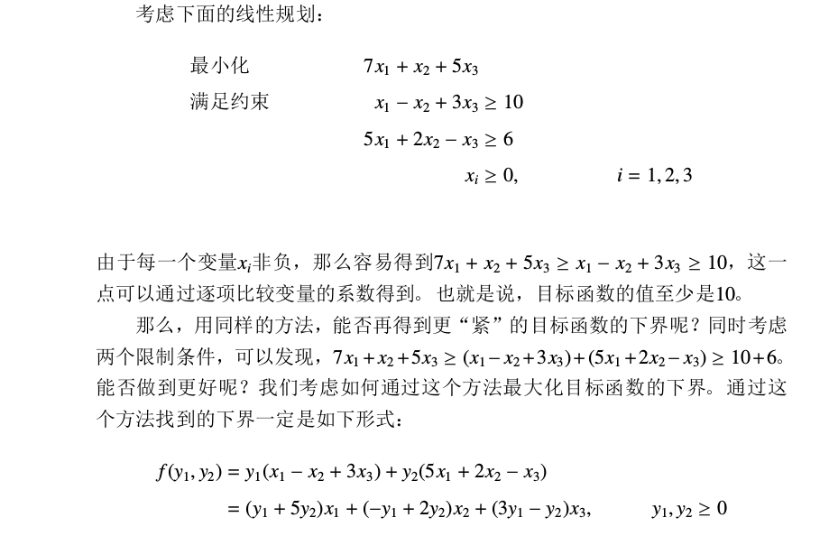
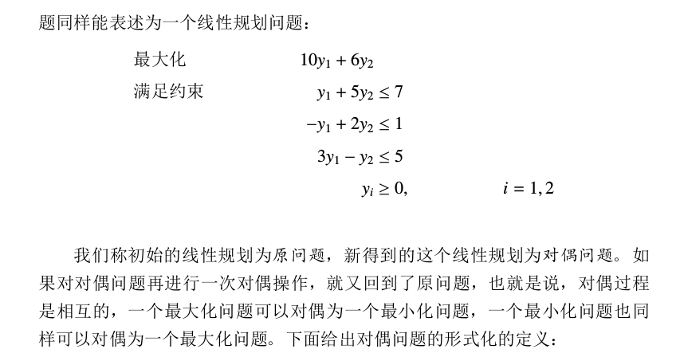
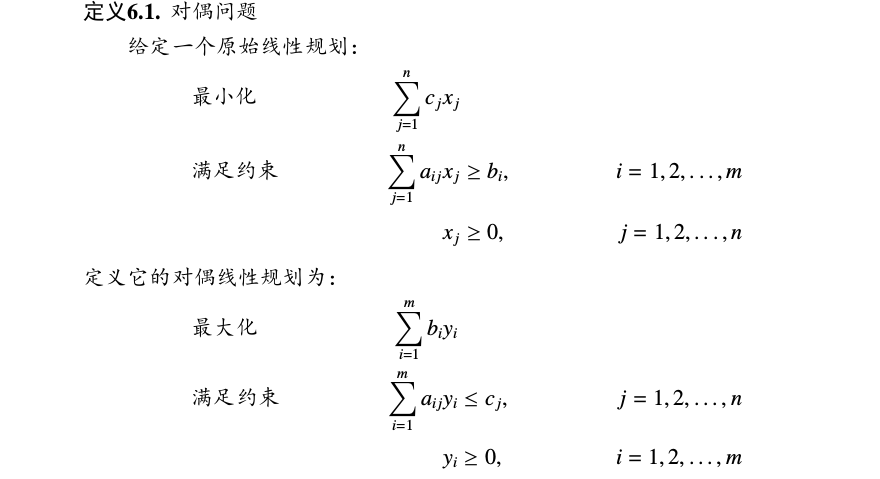

### Description

申奥成功后，布布经过不懈努力，终于成为奥组委下属公司人力资源部门的主管。布布刚上任就遇到了一个难题：为即将启动的奥运新项目招募一批短期志愿者。经过估算，这个项目需要N 天才能完成，其中第i 天至少需要Ai 个人。 布布通过了解得知，一共有M 类志愿者可以招募。其中第i 类可以从第Si 天工作到第Ti 天，招募费用是每人Ci 元。新官上任三把火，为了出色地完成自己的工作，布布希望用尽量少的费用招募足够的志愿者，但这并不是他的特长！于是布布找到了你，希望你帮他设计一种最优的招募方案。

### Solution

单纯形法

考虑这里是最小化，我们可以把问题对偶一下变成最大化。论文里讲的很清楚

!(../pic/18.8.7-2.png)





### Code

```cpp
#include<bits/stdc++.h>
using namespace std;
int n, m;
int A[10010], s[10010], T[10010], c[10010];
double a[10010][1010];
#define eps 1e-8
void pivot(int x, int y)
{
	double t = a[x][y]; a[x][y] = 1;
	for(int i = 0; i <= n; ++i) a[x][i] /= t;
	for(int i = 0; i <= m; ++i)
		if(i != x && abs(a[i][y]) > eps)
		{
			t = a[i][y]; a[i][y] = 0;
			for(int j = 0; j <= n; ++j) a[i][j] -= t * a[x][j];
		}
}
void simplex()
{
	while(1)
	{
		int x = 0, y = 0; double mn = 1e15;
		for(int i = 1; i <= n; ++i)
			if(a[0][i] > eps) { x = i; break; }
		if(!x) break;
		for(int i = 1; i <= m; ++i)
			if(a[i][x] > eps && a[i][0] / a[i][x] < mn)
				mn = a[i][0] / a[i][x], y = i;
		pivot(y, x);
	}
}
int main()
{
	freopen("a.in", "r", stdin);
	freopen("a.out", "w", stdout);
	scanf("%d%d", &n, &m);
	for(int i = 1; i <= n; ++i) scanf("%d", &A[i]);
	for(int i = 1; i <= m; ++i)
		scanf("%d%d%d", &s[i], &T[i], &c[i]);
	for(int i = 1; i <= n; ++i) a[0][i] = A[i] * 1.;
	for(int i = 1; i <= m; ++i)
	{
		a[i][0] = c[i] * 1.;
		for(int j = s[i]; j <= T[i]; ++j) a[i][j] = 1.0;
	}
	simplex();
	printf("%.0lf\n", -a[0][0]);
	return 0;
}
```

